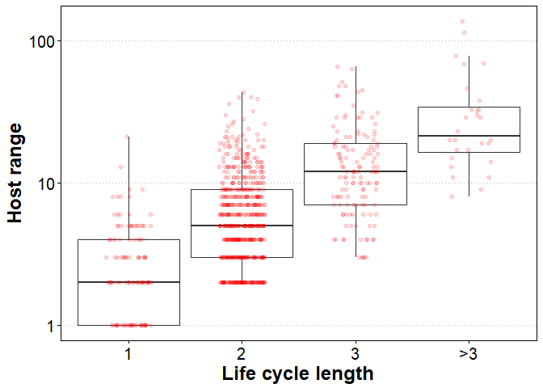
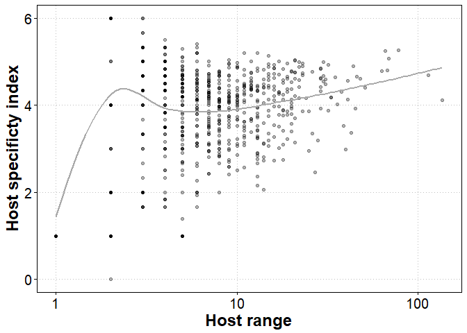
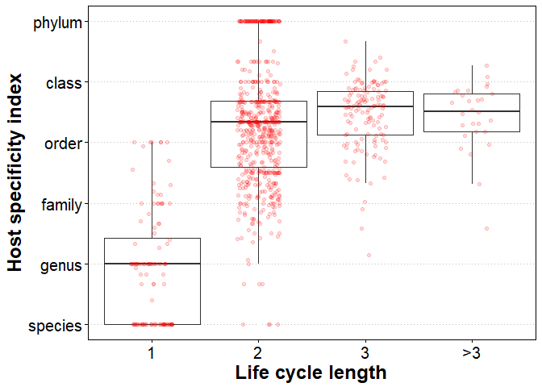
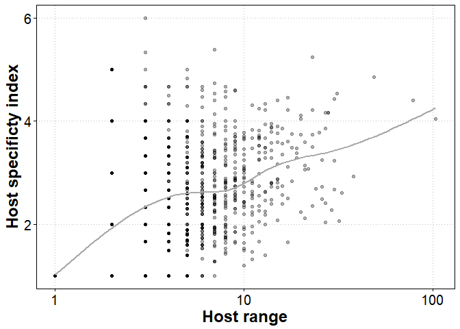
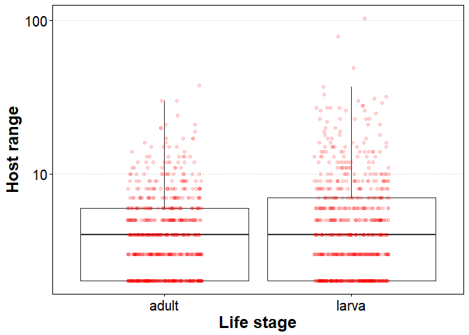
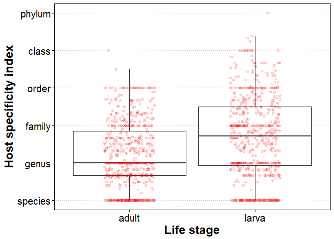
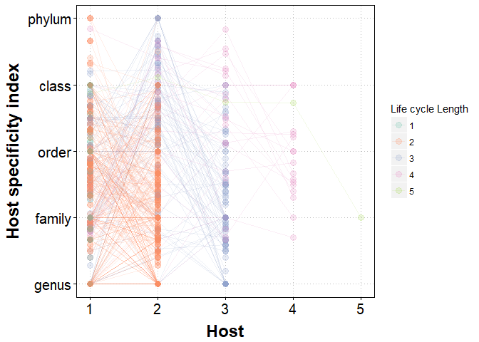
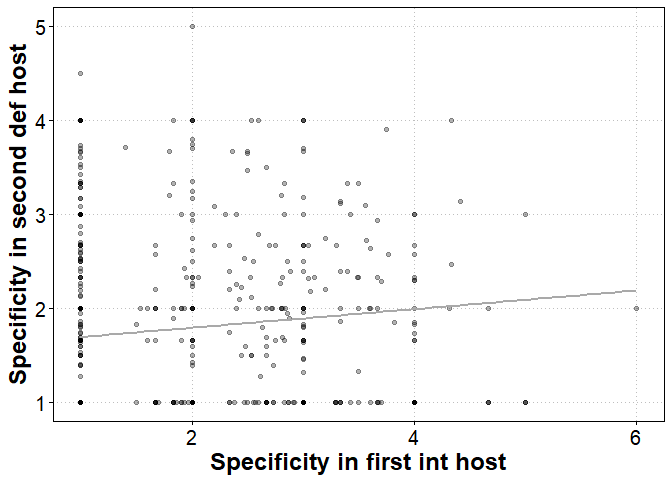
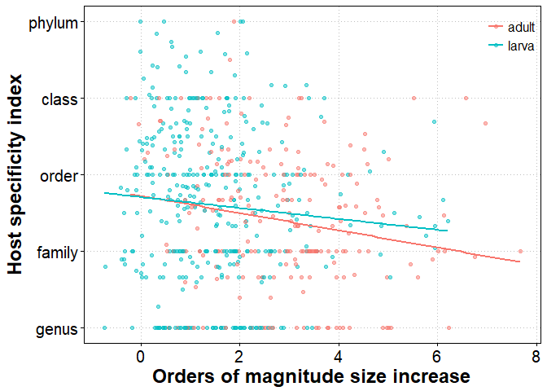
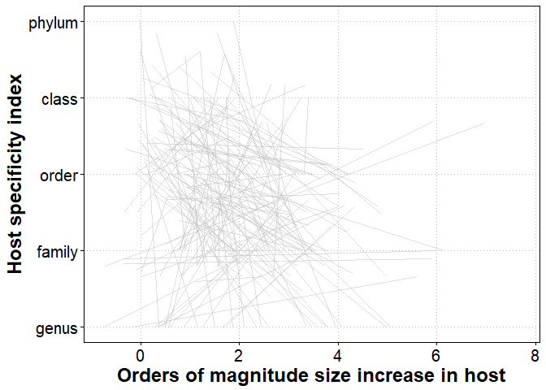

Host specificity analyses - calculate and analyze host specificity
================

**Background**: This script examines patterns of host specificity in complex life cycles. I use a [database](http://onlinelibrary.wiley.com/doi/10.1002/ecy.1680/suppinfo) of helminth (parasitic worm) life cycles to examine the diversity of hosts exploited by these parasites. Complex life cycle parasites infect dissimilar hosts during their life, e.g. an invertebrate as first host and a vertebrate as second host. Do complex life cycle parasites infect more hosts than simple life cycle parasites? How does specificity vary within cycles (i.e. larval vs adult stage). I use two specificity indices: host range and a specificity index that accounts for the taxonomic similarity of hosts. To calculate this second index, we need taxonomic information for each host. Taxonomic data can be downloaded from the NCBI by running the script [get\_clean\_host\_taxonomy](../get_taxonomy/get_clean_host_taxonomy.md).

Start as usual by loading libraries, setting a plotting theme, and importing data

``` r
library(dplyr)
library(ggplot2)
library(tidyr)
library(RColorBrewer)

options(stringsAsFactors = FALSE)

theme.o <- theme_update(axis.text = element_text(colour="black", size = 15),
                        axis.title = element_text(colour="black", size = 18, face = "bold", lineheight=0.25),
                        axis.ticks = element_line(colour="black"),
                        panel.border = element_rect(colour = "black",fill=NA),
                        panel.grid.minor=element_blank(),
                        panel.grid.major=element_line(color="gray",linetype = "dotted"),
                        panel.background= element_rect(fill = NA))

# load host database
dataH <- read.csv(file="../data/CLC_database_hosts.csv", header = TRUE, sep=",")
```

### Host specificity across entire life cycle

First, we look at the host range for a parasite, pooled across all stages (larval and adult). The host range is just the number of hosts from which a parasite has been recorded. Some parasite cycles were not complete (i.e. a host was assumed but not verified). We'll remove the parasite species where the life cycle is only partially known.

``` r
# identify and remove 'incomplete' parasite species
rp <- filter(dataH, Missing.info == 1, is.na(Host.species))%>%
  select(Parasite.species)%>%distinct()
dataH <- filter(dataH, !(Parasite.species %in% rp$Parasite.species))

# then calculate number of hosts
dataH.hs <- group_by(dataH, Parasite.species)%>%
  summarise(hosts = n(), maxLCL = max(Host.no))
```

When we plot host range vs life cycle length, we see the assumption that parasites with long cycles have bigger host ranges appears valid.

``` r
# make life cycle length a factor and pool the few parasites with life cycles longer than three hosts
dataH.hs <- mutate(dataH.hs, maxLCL.fac = if_else(maxLCL > 3, "4", as.character(maxLCL)))%>%
  mutate(maxLCL.fac = factor(maxLCL.fac, labels = c("1", "2", "3", ">3")))
```

``` r
outfig <- ggplot(dataH.hs,
                 aes(x = maxLCL.fac, y = hosts)) + 
  geom_boxplot(outlier.color = "white", width = 0.9) +
  geom_jitter(width = 0.2, height = 0, color = "red", alpha = 0.15) +
  labs(x = "Life cycle length", y = "Host range") + 
  scale_y_log10() +
  theme(panel.grid.major.x = element_blank())
outfig
```



``` r
# want to export this figure, for use in word doc; add (A) for panel
ggsave(filename = "../figs/hostrange_vs_lcl.png", width = 5, height = 4.5, units = "in")
ggsave(filename = "../figs/hostrange_vs_lcl.svg", width = 5, height = 4.5, units = "in")
```

A parasite with a direct cycle has a median of two hosts, whereas a parasite with 3 or more hosts has a median of over 21 hosts.

``` r
tapply(dataH.hs$hosts, dataH.hs$maxLCL.fac, median, na.rm=T)
```

    ##    1    2    3   >3 
    ##  2.0  5.0 12.0 21.5

The regression is also clearly significant.

``` r
summary(lm(log10(hosts) ~ maxLCL, data = dataH.hs))
```

    ## 
    ## Call:
    ## lm(formula = log10(hosts) ~ maxLCL, data = dataH.hs)
    ## 
    ## Residuals:
    ##      Min       1Q   Median       3Q      Max 
    ## -0.60471 -0.26421 -0.04236  0.21291  0.92140 
    ## 
    ## Coefficients:
    ##             Estimate Std. Error t value Pr(>|t|)    
    ## (Intercept)  0.06031    0.03537   1.705   0.0885 .  
    ## maxLCL       0.34051    0.01621  21.002   <2e-16 ***
    ## ---
    ## Signif. codes:  0 '***' 0.001 '**' 0.01 '*' 0.05 '.' 0.1 ' ' 1
    ## 
    ## Residual standard error: 0.3052 on 879 degrees of freedom
    ## Multiple R-squared:  0.3341, Adjusted R-squared:  0.3334 
    ## F-statistic: 441.1 on 1 and 879 DF,  p-value: < 2.2e-16

Host range is a simple metric. For example, it does not account for the taxonomic dissimilarity of hosts. A parasite may infect many taxonomically similar hosts (high host range, low dissimilarity) or few taxonomically divergent hosts (low host range, high dissimilarity). Let's load the host taxonomy data and calculate a more complex measure of specificity.

``` r
host.tax <- read.csv(file="../data/ncbi_host_taxonomy.csv", header = TRUE, sep=",") # taxonomy from NCBI
```

Add taxonomy to the main host table.

``` r
dataH <- left_join(dataH, 
                   select(host.tax, sp.query, genus, family, order, class, phylum),
                   by = c("Host.species" = "sp.query"))
```

This is how much missing taxonomic data is in the combined table.

``` r
sapply(select(dataH, Host.species, genus:phylum), function(x) sum(is.na(x)))
```

    ## Host.species        genus       family        order        class 
    ##            8          316          316          317          339 
    ##       phylum 
    ##          320

Before calculating a specificity index, we need to reduce the data to just those hosts with a full taxonomic hierarchy, otherwise specificity calculations are not comparable.

``` r
phy.hs <- select(dataH, Parasite.species, Host.no, Stage, Host.species, # retain host.no and stage, as this table is used again below when calculating specificity at level of stage
                 genus, family, order, class, phylum)%>%
  filter(!is.na(family) | !is.na(order) | !is.na(class) | !is.na(phylum))
```

Let's calculate the host specificity index proposed by [Poulin and Mouillot 2003](https://doi.org/10.1017/S0031182003002993) that accounts for the taxonomic similarity of hosts. We load a couple functions from an external file for calculating this index.

``` r
source("host_specificity_index_calculation_functions.R")
```

Then we loop through all the parasite species to calculate the host specificity index.

``` r
spst <- select(phy.hs, Parasite.species)%>%distinct() # unique parasite spp after removing hosts with missing tax data
spst$hs <- NA # numeric to collect calculated host specificity index
spst$var.hs <- NA # numeric to collect calculated variation in host specificity index

for(i in seq_along(spst$Parasite.species)){
  mv <- spst[i,]
  ds <- filter(phy.hs, Parasite.species == mv$Parasite.species)
  hs.out <- with(ds, hs.index(Host.species, genus, family, order, class, phylum)) # calc host spec index
  spst$hs[i] <- hs.out[1]
  spst$var.hs[i] <- hs.out[2]
  rm(mv, ds, hs.out, i)
}
# two notes: host spec values include atypical species and they were calculated omitting hosts without full tax info
```

Add the host specificity index to the species-level table for plotting.

``` r
dataH.hs <- left_join(dataH.hs, spst)
```

Host range and the host specificity index do not correlate. That is, these two measures of host specificity are independent of one another.

``` r
ggplot(dataH.hs, aes(x = hosts, y = hs)) + 
  geom_point(alpha = 0.3) + 
  geom_smooth(se=F, color = 'darkgrey') +
  scale_x_log10() +
  labs(x = "Host range", y = "Host specificty index")
```



Plot the relationship between life cycle length and the host specificity index. There is a clear increase in taxonomic diversity between 1- and 2-hosts cycles, but then expanding the life cycle further does not result in a more diverse host repetoire.

``` r
tax.ranks <- c('genus', 'family', 'order', 'class', 'phylum') # for axis label

outfig <- ggplot(dataH.hs,
                 aes(x = maxLCL.fac, y = hs)) + 
  geom_boxplot(outlier.color = "white", width = 0.9) +
  geom_jitter(width = 0.2, height = 0, color = "red", alpha = 0.15) +
  labs(x = "Life cycle length", y = "Host specificity index") + 
  scale_y_continuous(limits = c(1,6), breaks = c(1:6), labels = c("species", tax.ranks)) +
  theme(panel.grid.major.x = element_blank())
outfig
```



``` r
# want to export this figure, for use in word doc
ggsave(filename = "../figs/hostdissimilarity_vs_lcl.png", width = 5, height = 4.5, units = "in")
ggsave(filename = "../figs/hostdissimilarity_vs_lcl.svg", width = 5, height = 4.5, units = "in")
```

### Host specificity variation within life cycles

Now we turn attention to variation within a cycle. Instead of calculating host specificity across the whole cycle (i.e. larva and adult stages pooled), we want to calculate host specificity for each life stage separately. We are interested in whether certain stage in a life cycle are more or less specific. First, we recalculate host range at the level of stage for each species.

``` r
dataH.hs <- group_by(dataH, Parasite.species, Host.no, Stage)%>%
  summarise(hosts = n())
```

Then we loop through the 'species stages' and calculate the host specificity index.

``` r
spst<-select(phy.hs, Parasite.species, Host.no, Stage)%>%distinct() # unique parasite stages for each species
spst$hs <- NA # numeric to collect calculated host specificity index
spst$var.hs <- NA # numeric to collect calculated variation in host specificity index

for(i in seq_along(spst$Parasite.species)){
  mv <- spst[i,]
  ds <- filter(phy.hs, Parasite.species == mv$Parasite.species &
                 Host.no == mv$Host.no &
                 Stage == mv$Stage)
  hs.out <- with(ds, hs.index(Host.species, genus, family, order, class, phylum)) # calc host spec index
  spst$hs[i] <- hs.out[1]
  spst$var.hs[i] <- hs.out[2]
  rm(mv, ds, hs.out, i)
}
# two notes: host spec values include atypical species and they were calculated omitting hosts without full tax info
```

Add host specificity to the table at the level of 'species stage'.

``` r
#take estimated host specificity values and add them to table dataset
dataH.hs <- left_join(dataH.hs, spst)
rm(phy.hs, spst)
```

We can again compare the two specificity measures. At this more granular level, there is a correlation between host number and taxonomic diversity of the hosts. That is, stages with more recorded hosts also tend to have dissimilar hosts.

``` r
ggplot(dataH.hs, aes(x = hosts, y = hs)) + 
  geom_point(alpha = 0.3) + 
  geom_smooth(se=F, color = 'darkgrey') +
  scale_x_log10() +
  labs(x = "Host range", y = "Host specificty index")
```



We can now also compare larval vs adult stages. The host ranges of larvae and adults are comparable.

``` r
dataH.hs <- mutate(dataH.hs, stage2 = if_else(Stage == "adult", "adult", "larva"))

ggplot(filter(dataH.hs, hosts > 1), # ignore cases where parasite recorded only in one host
       aes(x = stage2, y = hosts)) +
  geom_boxplot(outlier.color = "white", width = 0.9) +
  geom_jitter(width = 0.2, height = 0, color = "red", alpha = 0.15) +
  labs(x = "Life stage", y = "Host range") + 
  scale_y_log10() +
  theme(panel.grid.major.x = element_blank())
```



But larval stages tend to infect a bit broader diversity of hosts. It is also worth noting that, across the whole life cycle, a typical complex life cycle parasite species will infect hosts from different classes or even phyla. By contrast, a given stage rarely infects hosts belonging to different classes.

``` r
ggplot(filter(dataH.hs, hosts > 1), # ignore cases where parasite recorded only in one host
       aes(x = stage2, y = hs)) +
  geom_boxplot(outlier.color = "white", width = 0.9) +
  geom_jitter(width = 0.2, height = 0, color = "red", alpha = 0.15) +
  labs(x = "Life stage", y = "Host specificity index") + 
  scale_y_continuous(limits = c(1,6), breaks = c(1:6), labels = c("species", tax.ranks)) +
  theme(panel.grid.major.x = element_blank())
```



Instead of just differentiating between adults and larvae, we can look a little more closely at how host specificity varies over the life cycle. For example, what does specificity look like in first intermediate hosts, second intermediate hosts, etc? To look at this, We need to distinguish between parasites with long or short cycles, so let's add a life cycle length variable to the data.

``` r
LCL <- group_by(dataH, Parasite.species)%>%summarize(maxLCL = max(Host.no))
dataH.hs <- left_join(dataH.hs, LCL)
```

Then we plot a slopegraph showing how host specificity varies across the hosts in the life cycle. The plot is pretty messy; it is hard to distinguish between parasites with different life cycle lengths. It probably looks better when we separate out each life cycle group.

``` r
mypalette <- brewer.pal(5, "Set2")

ggplot(data=filter(dataH.hs, hosts > 1),
       aes(x=factor(Host.no), y=hs, group=Parasite.species, color=as.factor(maxLCL))) +
  geom_line(alpha=0.15) + 
  geom_point(size=3, alpha=0.2) +
  labs(x = "\nHost", y = "Host specificity index\n", color = "Life cycle Length") +
  scale_color_manual(values = mypalette)+
  scale_x_discrete(expand=c(0.05,0.05)) +
  scale_y_continuous(limits = c(1,5), breaks = c(1:5), labels = tax.ranks)
```



Make a plot for each life cycle length separately, in which the group-of-interest is highlighted and overlaid on the remaining species.

``` r
g1 <- ggplot(data=filter(dataH.hs, hosts > 1, maxLCL != 1),
       aes(x=factor(Host.no), y=hs, group=Parasite.species)) +
  geom_line(alpha=0.15, color = "lightgray") + 
  geom_point(size=3, alpha=0.1, color = "lightgray") +
  geom_point(data = filter(dataH.hs, hosts > 1, maxLCL == 1),
             size = 3, alpha = 0.33, color = mypalette[1]) +
  labs(x="\nHost",y="Host specificity index\n") +
  scale_x_discrete(expand=c(0.05,0.05)) +
  scale_y_continuous(limits = c(1,5), breaks = c(1:5), labels = tax.ranks) +
  annotate('text', x = 4.5, y = 4.5, label = '1-host cycle', color = mypalette[1], size = 5)
```

``` r
g2 <- ggplot(data=filter(dataH.hs, hosts > 1, maxLCL != 2),
       aes(x=factor(Host.no), y=hs, group=Parasite.species)) +
  geom_line(alpha=0.15, color = "lightgray") + 
  geom_point(size=3, alpha=0.1, color = "lightgray") +
  geom_point(data = filter(dataH.hs, hosts > 1, maxLCL == 2),
             size = 3, alpha = 0.25, color = mypalette[2]) +
  geom_line(data = filter(dataH.hs, hosts > 1, maxLCL == 2),
            alpha = 0.2, color = mypalette[2]) +
  labs(x="\nHost",y="Host specificity index\n") +
  scale_x_discrete(expand=c(0.05,0.05)) +
  scale_y_continuous(limits = c(1,5), breaks = c(1:5), labels = tax.ranks) +
  annotate('text', x = 4.5, y = 4.5, label = '2-host cycle', color = mypalette[2], size = 5)
```

``` r
g3 <- ggplot(data=filter(dataH.hs, hosts > 1, maxLCL != 3),
       aes(x=factor(Host.no), y=hs, group=Parasite.species)) +
  geom_line(alpha=0.15, color = "lightgray") + 
  geom_point(size=3, alpha=0.1, color = "lightgray") +
  geom_point(data = filter(dataH.hs, hosts > 1, maxLCL == 3),
             size = 3, alpha = 0.25, color = mypalette[3]) +
  geom_line(data = filter(dataH.hs, hosts > 1, maxLCL == 3),
            alpha = 0.2, color = mypalette[3]) +
  labs(x="\nHost",y="Host specificity index\n") +
  scale_x_discrete(expand=c(0.05,0.05)) +
  scale_y_continuous(limits = c(1,5), breaks = c(1:5), labels = tax.ranks) +
  annotate('text', x = 4.5, y = 4.5, label = '3-host cycle', color = mypalette[3], size = 5)
```

``` r
g4 <- ggplot(data=filter(dataH.hs, hosts > 1, maxLCL <= 3),
       aes(x=factor(Host.no), y=hs, group=Parasite.species)) +
  geom_line(alpha=0.15, color = "lightgray") + 
  geom_point(size=3, alpha=0.1, color = "lightgray") +
  geom_point(data = filter(dataH.hs, hosts > 1, maxLCL > 3),
             size = 3, alpha = 0.25, color = mypalette[4]) +
  geom_line(data = filter(dataH.hs, hosts > 1, maxLCL > 3),
            alpha = 0.2, color = mypalette[4]) +
  labs(x="\nHost",y="Host specificity index\n") +
  scale_x_discrete(expand=c(0.05,0.05)) +
  scale_y_continuous(limits = c(1,5), breaks = c(1:5), labels = tax.ranks) +
  annotate('text', x = 4.5, y = 4.5, label = '>3-host cycle', color = mypalette[4], size = 5)
```

To facilitate comparisons, we put all 4 plots together. The [multiplot](http://www.cookbook-r.com/Graphs/Multiple_graphs_on_one_page_(ggplot2)/) function was taken from the R graphics cookbook site.

``` r
source("multiplot.R") # function from the R cookbook
multiplot(g1, g3, g2, g4, cols = 2)
```


I also experimented with an *interactive* version of this plot using R shiny. The next code block exports the needed data. [Here](../interactive_shiny_plot/app.R) is the script and [here](https://dbenesh82.shinyapps.io/parasite_specificity_across_the_life_cycle/) is the plot.

``` r
write.table(dataH.hs, file = "../interactive_shiny_plot/data_for_shiny.csv", row.names = F, sep = ",")
```

One trend is that worms are rather generalist in the second intermediate host in three-host cycles, but in my opinion, no patterns really jump out of these slopegraphs. Perhaps the most important take away is that host specificty can change a lot over a cycle. The abundance of crossing lines (i.e. specificity can be very high in one stage and low in the next, or vice versa) could suggest there is a tradeoff across stages. To look for such a tradeoff, we need to 'spread' the data, i.e. make long data wide.

``` r
hs_cov <- select(dataH.hs, Parasite.species, Host.no, maxLCL, hs)%>%
  spread(key = Host.no, value = hs)
names(hs_cov) <- c("Parasite.species", "maxLCL", "first", "second", "third", "fourth", "fifth")
```

And then we check for a negative correlation in host specificity between consecutive stages. We just look at the relationship between the first host and second host for parasites with two-host life cycles. It is the most common combination in the data. There is no indication of a tradeoff.

``` r
ggplot(filter(hs_cov, maxLCL == 2), 
       aes(x = first, y = second)) + 
  geom_point(alpha = 0.3) + 
  geom_smooth(method='lm', se=F, color = "darkgrey") +
  labs(x = "Specificity in first int host", y = "Specificity in second def host")
```



### Specificity vs growth tradeoff

We can examine another potential tradeoff related to host specificity. Namely, that generalist stages grow less. A common idea about the evolution of specificity is that a 'jack-of-all-trades is a master of none'. That is, generalists (jacks) pay for their wide host ranges with less growth, while specialists (masters) grow extensively. Let's import the parasite body size data from the life cycle database.

``` r
dataL <- read.csv(file="../data/CLC_database_lifehistory.csv", header = TRUE, sep=",")
```

Convert length and width measurements into estimates of biomass.

``` r
dataL <- mutate(dataL, biovolume = 
                  if_else(Shape %in% c("cylinder", "thread-like", "whip"), 
                          pi * (Width/2)^2 * Length, # calculate volume as a cylinder
                          if_else(Shape %in% c("coiled", "sphere", "ellipsoid"),
                                  4/3 * pi * Length/2 * Width/4, # calculate volume as a ellipsoid
                                  Length * Width # calculate volume as area for remaining ribbon, leaf shapes
                                  )),
                biovolume = biovolume * 1.1) # covert to biomass with assumed 1.1. g/cm3 tissue density 
```

For each parasite species, we want to calculate how much growth occurs in each stage. But before doing that, we should eliminate a few troublesome values (species with asexual reproduction as larvae and adult male measurements).

``` r
dataL <- filter(dataL, is.na(Asexual))%>% # remove data for asexual species
  filter( !(Stage == 'adult' & Sex == 'm') ) # remove adult males
```

Life starts as a propagule, and there are multiple propagule size measurements for a given species. If the egg hatches, we want to take the free larva stage. If it does not hatch, we would like the embryo stage (this is what hatches from the egg and better represents initial size at growth). However, embryo sizes were not always reported, so in those case where embryo size was absent, we took egg size. This assumes that the size difference between embryo and egg is rather small, especially relative to the amount of growth conducted in the first host.

``` r
# id species that hatch or not
eggos <- filter(dataL, Host.no == 0)%>%
  select(Parasite.species, Egg.hatch)%>%
  mutate(propagule_selector = if_else(Egg.hatch != "eaten", "free larva", "egg"))%>%
  select(-Egg.hatch)%>%
  na.omit%>%distinct()

# determine whether there is a size measurement for embryo or egg stages
eggos2 <- filter(dataL, Host.no == 0)%>%
  select(Parasite.species, Stage, biovolume)%>%
  group_by(Parasite.species, Stage)%>%
  summarize(x = sum(!is.na(biovolume)))

# combine and spread these two tables
eggos2 <- left_join(eggos, eggos2)
eggos2 <- spread(na.omit(eggos2), Stage, x)

# identify the stage where growth starts for each species
eggos2 <- mutate(eggos2, propagule_selector = if_else(propagule_selector == 'free larva', 'free larva',
                                                       if_else(embryo > 0, 'embryo', 'egg')))

# add selector variable to main life history table
eggos2 <- select(eggos2, Parasite.species, propagule_selector)
dataL <- left_join(dataL, eggos2)
rm(eggos, eggos2)
```

Remove propagule measurements that do not best reflect the initial growth size.

``` r
dataL <- filter(dataL, !(Host.no == 0 & Stage != propagule_selector))
```

Average body size for the stages for each species.

``` r
dataL.sp <- group_by(dataL, Parasite.species, Host.no, Stage)%>%
  summarize(biovolume = mean(biovolume, na.rm=T))
```

Then we calculate absolute and relative body size differences between consecutive life stages, i.e. how much worms grow at a certain life stage.

``` r
dataL.sp <- arrange( ungroup(dataL.sp), Parasite.species, Host.no)%>% # arrange by species and host.no
  mutate(biov = lag(x = biovolume, 1))%>% # make a variable representing size in previous stage
  mutate(abs_diff = biovolume - biov, # absolute size diff
         rel_diff = log10(biovolume) - log10(biov)) # relative size diff

# remove growth values for egg stages; arise when calculating 'species B egg' - 'species A adult'
dataL.sp$abs_diff[which(dataL.sp$Host.no == 0)] <- NA 
dataL.sp$rel_diff[which(dataL.sp$Host.no == 0)] <- NA

# reduce data to just rows where a growth could be calculated
dataL.sp <- filter(dataL.sp, !is.na(abs_diff))%>%
  select(Parasite.species, Host.no, Stage, abs_diff, rel_diff)
```

And we combine growth and host specificity dataframes that are at the 'species stage' level.

``` r
growth_df <- left_join(dataH.hs, dataL.sp)
```

Plot the relationship between host specificity and relative growth (i.e. the orders of magnitude increase in size).

``` r
outfig <- ggplot(filter(growth_df, hosts > 1),
                 aes(x = rel_diff, y = hs, color = stage2)) + 
  geom_point(alpha = 0.5) +
  geom_smooth(method = 'lm', se=F) +
  scale_y_continuous(limits = c(1,5), breaks = c(1:5), labels = tax.ranks) +
  theme(legend.title = element_blank(),
        legend.position = c(1,1),
        legend.justification = c(1,1),
        legend.background = element_blank(),
        legend.text = element_text(size = 12),
        legend.key = element_rect(fill = NA)) +
  labs(x = "Orders of magnitude size increase", y = "Host specificity index")
outfig
```



``` r
# want to export this figure, for use in word doc
ggsave(filename = "../figs/hostdissimilarity_vs_growth.png", width = 5.5, height = 5, units = "in")
```

It is noisy, but negative. More growth at a given stage is associated with being more host specific at that stage. And this does not seem to differ between adult and larval stages. A simple linear regression is also significant.

``` r
summary(lm(hs ~ rel_diff, growth_df))
```

    ## 
    ## Call:
    ## lm(formula = hs ~ rel_diff, data = growth_df)
    ## 
    ## Residuals:
    ##     Min      1Q  Median      3Q     Max 
    ## -1.4389 -1.0676 -0.1404  0.8228  3.2266 
    ## 
    ## Coefficients:
    ##             Estimate Std. Error t value Pr(>|t|)    
    ## (Intercept)  2.35826    0.06587  35.801  < 2e-16 ***
    ## rel_diff    -0.11068    0.02627  -4.213 2.81e-05 ***
    ## ---
    ## Signif. codes:  0 '***' 0.001 '**' 0.01 '*' 0.05 '.' 0.1 ' ' 1
    ## 
    ## Residual standard error: 1.081 on 804 degrees of freedom
    ##   (1033 observations deleted due to missingness)
    ## Multiple R-squared:  0.0216, Adjusted R-squared:  0.02038 
    ## F-statistic: 17.75 on 1 and 804 DF,  p-value: 2.809e-05

Each point on the previous plot is not necessarily independent, given that multiple growth measurements can come from a single species (e.g. growth in first host, second host, etc.). Previously, we saw that specificity in first and second hosts is uncorrelated, so it is not likely that this matters. Still, we can take the previous plot and see if the parasite species seems to matter.

``` r
ggplot(filter(growth_df, hosts > 1),
       aes(x = rel_diff, y = hs)) + 
  geom_line(aes(group = Parasite.species), alpha = 0.5, color = 'gray') +
  scale_y_continuous(limits = c(1,5), breaks = c(1:5), labels = tax.ranks) +
  theme(legend.title = element_blank(),
        legend.position = c(1,1),
        legend.justification = c(1,1)) +
  labs(x = "Orders of magnitude size increase in host", y = "Host specificity index")
```



The lines here connect values for the same species. There is no obvious pattern, so it is not like big species are consistently more host specific or that high specificity at one stage necessitates low specificity at another stage.

We can check this with a statistical model. We fit a mixed model, with parasite species as a random effect. This random effect explains essentially none of the variation in host specificity. When we add growth to the model, we see a significant improvement, consistent with the observed negative trend.

``` r
library(lme4)

out1 <- lmer(hs ~ stage2 + (1 | Parasite.species),
            data = filter(growth_df, !is.na(rel_diff), hosts > 1))
out2 <- lmer(hs ~ rel_diff + stage2 + (1 | Parasite.species),
            data = filter(growth_df, !is.na(rel_diff), hosts > 1))
summary(out2)
```

    ## Linear mixed model fit by REML ['lmerMod']
    ## Formula: hs ~ rel_diff + stage2 + (1 | Parasite.species)
    ##    Data: filter(growth_df, !is.na(rel_diff), hosts > 1)
    ## 
    ## REML criterion at convergence: 1668.3
    ## 
    ## Scaled residuals: 
    ##      Min       1Q   Median       3Q      Max 
    ## -1.85860 -0.68527  0.02209  0.66417  2.82639 
    ## 
    ## Random effects:
    ##  Groups           Name        Variance Std.Dev.
    ##  Parasite.species (Intercept) 0.0000   0.0000  
    ##  Residual                     0.9688   0.9843  
    ## Number of obs: 591, groups:  Parasite.species, 439
    ## 
    ## Fixed effects:
    ##             Estimate Std. Error t value
    ## (Intercept)  2.67000    0.10794  24.736
    ## rel_diff    -0.09264    0.03033  -3.055
    ## stage2larva  0.09187    0.09257   0.992
    ## 
    ## Correlation of Fixed Effects:
    ##             (Intr) rl_dff
    ## rel_diff    -0.788       
    ## stage2larva -0.777  0.424

``` r
anova(out1, out2)
```

    ## Data: filter(growth_df, !is.na(rel_diff), hosts > 1)
    ## Models:
    ## out1: hs ~ stage2 + (1 | Parasite.species)
    ## out2: hs ~ rel_diff + stage2 + (1 | Parasite.species)
    ##      Df    AIC    BIC  logLik deviance  Chisq Chi Df Pr(>Chisq)   
    ## out1  4 1672.8 1690.3 -832.38   1664.8                            
    ## out2  5 1665.5 1687.4 -827.73   1655.5 9.3066      1   0.002283 **
    ## ---
    ## Signif. codes:  0 '***' 0.001 '**' 0.01 '*' 0.05 '.' 0.1 ' ' 1

The absence of a 'species effect' does not necessarily mean it is irrelevant. It may just be that at the species level there is too much variation to see a trend, perhaps due to measurement error. There might be broader phylogenetic trends, where one parasite clade is consistently generalist at one stage and specific at another. In other words, we need a parasite phylogeny to more fully evaluate these patterns.
